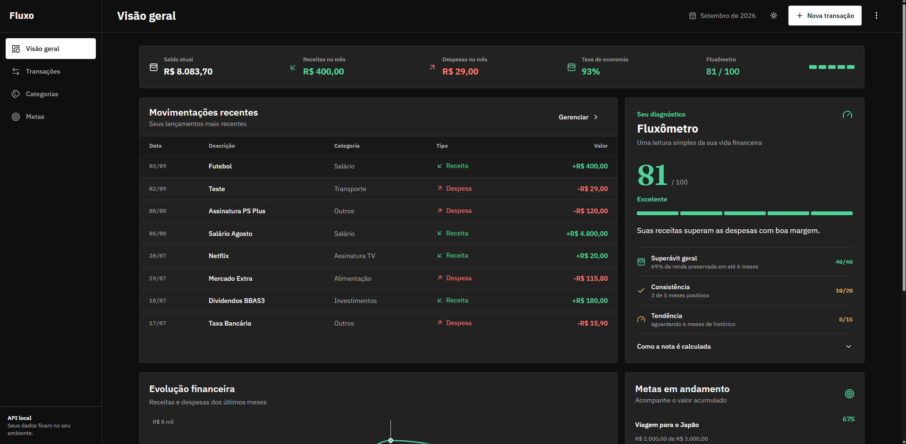
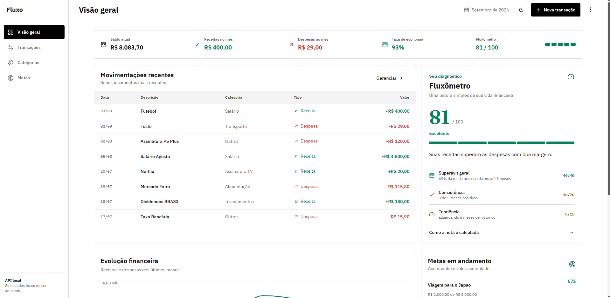
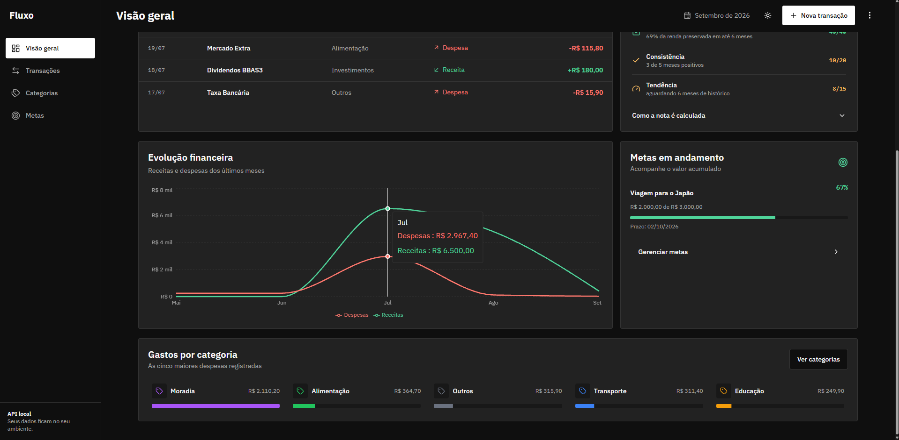
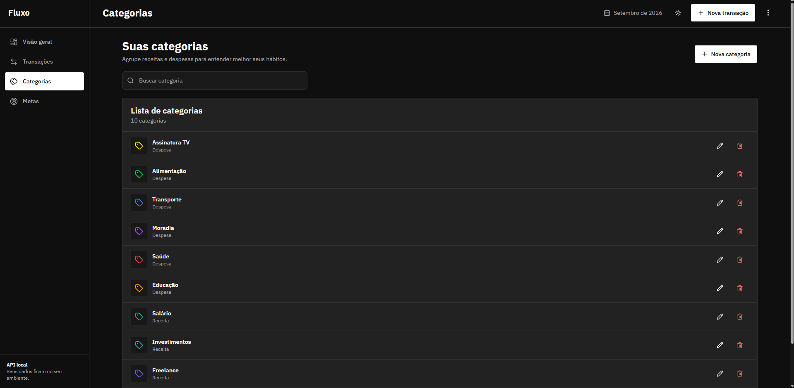
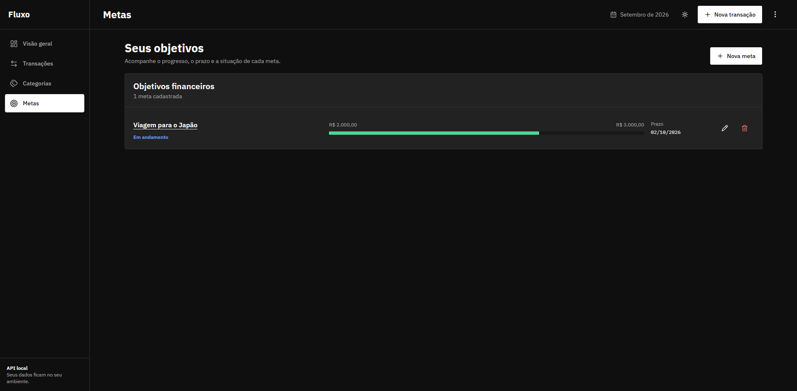
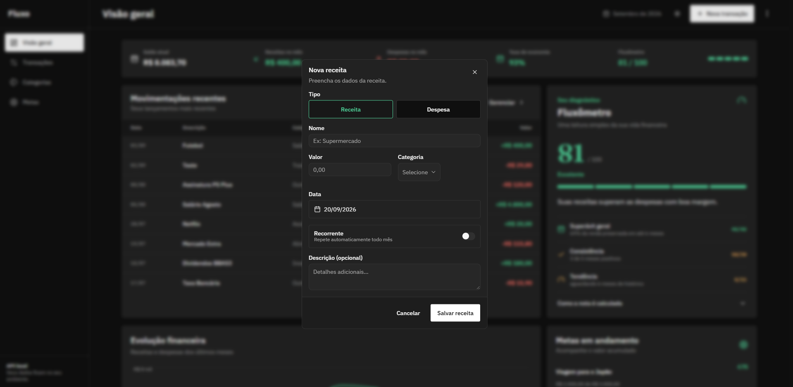

# Fluxo

Sistema de gestão financeira pessoal criado para ajudar iniciantes a registrar movimentações e entender melhor a própria vida financeira.

O Fluxo combina uma API REST em Spring Boot com uma interface web responsiva em React. Seu principal diferencial é o **Fluxômetro**, uma leitura explicável da situação financeira baseada em receitas, despesas, evolução e metas.

## Demonstração

A aplicação funciona localmente, sem conta ou serviço em nuvem. Os dados ficam no PostgreSQL configurado no computador do usuário.

## Demonstração visual

### Dashboard em tema escuro



### Dashboard em tema claro



### Evolução financeira e gastos por categoria



### Categorias



### Metas



### Cadastro de receita



O dashboard apresenta:

- saldo atual, receitas, despesas e taxa de economia;
- diagnóstico do Fluxômetro com estado neutro quando ainda não existem dados;
- movimentações recentes;
- evolução financeira;
- gastos por categoria;
- metas e progresso dos objetivos.

Também é possível criar, consultar, editar e excluir transações, categorias e metas. As páginas de detalhe permitem consultar informações relacionadas e realizar ações específicas.

## Tecnologias

### Backend

- Java 21
- Spring Boot 3
- Spring Data JPA
- PostgreSQL
- Maven Wrapper
- JUnit 5, Mockito e MockMvc

### Frontend

- React 19
- TypeScript
- Vite
- Tailwind CSS
- React Hook Form e Zod
- Axios
- Recharts
- Lucide Icons

## Estrutura

```text
backend/    API REST, regras de negócio, persistência e testes
frontend/   interface web responsiva e integração com a API
README.md   documentação principal para execução e demonstração
```

## Pré-requisitos

- JDK 21
- Node.js 20 ou superior
- npm
- PostgreSQL

## Configuração do banco

Crie um banco local chamado `fluxo`:

```sql
CREATE DATABASE fluxo;
```

Copie `backend/src/main/resources/application-exemplo.properties` para `backend/src/main/resources/application.properties` e informe as credenciais do seu PostgreSQL. O arquivo local está protegido pelo `.gitignore` e não deve ser enviado ao GitHub.

## Executando

Em um terminal, inicie a API:

```powershell
cd backend
.\mvnw.cmd spring-boot:run
```

Em outro terminal, inicie a interface:

```powershell
cd frontend
npm install
npm run dev
```

Abra [http://127.0.0.1:5174](http://127.0.0.1:5174). O Vite encaminha as requisições `/api` para `http://localhost:8080`.

## Validação

Backend:

```powershell
cd backend
.\mvnw.cmd test
```

Frontend:

```powershell
cd frontend
npm run lint
npm run build
```

## API principal

| Recurso | Rotas |
| --- | --- |
| Transações | `GET`, `POST` `/transacoes`; `GET`, `PUT`, `DELETE` `/transacoes/{id}` |
| Categorias | `GET`, `POST` `/categorias`; `GET`, `PUT`, `DELETE` `/categorias/{id}` |
| Metas | `GET`, `POST` `/metas`; `GET`, `PUT`, `DELETE` `/metas/{id}` |
| Dashboard | `GET /dashboard` |

Uma categoria vinculada a transações não pode ser excluída; nesse caso a API retorna `409 Conflict`.

## Segurança e escopo

Esta versão é voltada para demonstração local. Ela não possui autenticação ou gestão de usuários. Não publique uma base com dados financeiros reais.

Para um deploy público, ainda será necessário configurar PostgreSQL hospedado, variáveis de ambiente, CORS restrito ao domínio do frontend e autenticação.